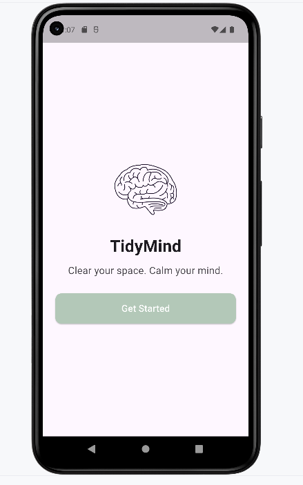
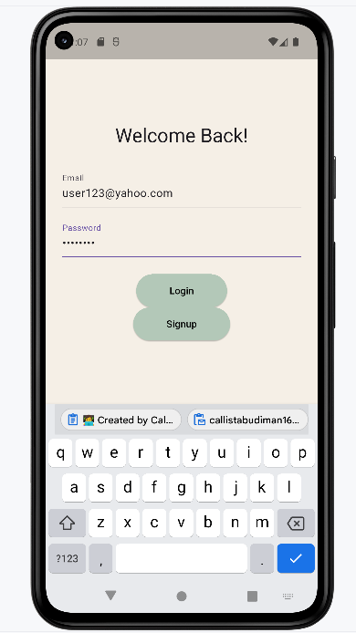
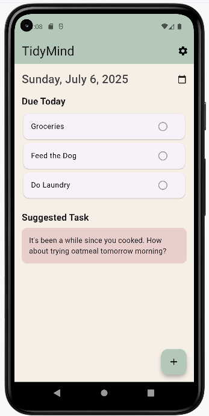
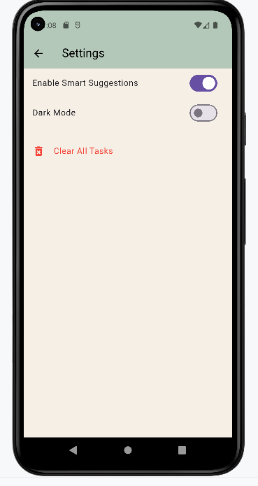

# 🧠 TidyMind

TidyMind is a clean, task-oriented Flutter app that helps users organize daily responsibilities while keeping mental clarity in focus. Users can add, repeat, check off, and delete tasks, as well as toggle smart suggestions for a personalized experience. All data is securely synced through Firebase.


Created By
Natasha Callista Budiman
📧 callistabudiman16@github.com
🎓 Cal Poly Pomona | CS4750 | Summer 2025

---

## ✨ Features

- ✅ **User Authentication** via Firebase (Login & Signup)
- 📅 **Task Management**: Add tasks with due dates, optional descriptions, and completion toggles
- 🔁 **Smart Repetition**: Repeat tasks every X days, for Y times
- ☁️ **Cloud Sync**: Tasks stored per user using Firestore
- 🌓 **Theme Switching**: Light and dark mode toggle
- 🧠 **Smart Suggestions**: Optional contextual task suggestions (not implemented yet)
- 🧹 **Bulk Delete**: Clear all tasks from Firebase in one tap

---






---

## Future Implementation

🧠 Smart Features (Planned)
When user adds a chore like “cook,” the app may suggest:
“How about trying oatmeal tomorrow morning?”

If user sets “repeat every 7 days,” the app generates upcoming instances.

---

### Installation

**Clone the repository**

```bash
git clone https://github.com/callistabudiman16/TidyMind-Final.git
cd TidyMind-Final

lib/
├── main.dart            # Theme setup & main function
├── authpage.dart        # Firebase login/signup
├── homepage.dart        # Task dashboard (add, delete, settings)
├── addnewtask.dart      # Create task with description and repeat options
├── settings.dart        # Toggle theme & clear tasks
├── task.dart            # Task model (to/from JSON)
├── theme.dart           # ThemeNotifier for light/dark mode

